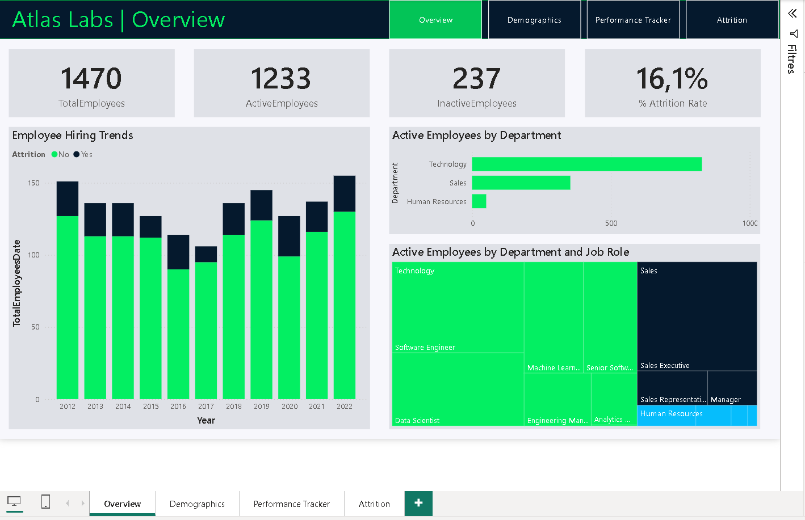

# HR Analytics – Employee Attrition Dashboard (Power BI)

## Project Overview
This project analyzes **employee attrition (turnover)** using **Power BI**.
The goal is to help **HR teams and managers** understand why employees leave, identify at-risk groups, and support **data-driven retention strategies**.

The dashboard combines **demographic analysis**, **performance and satisfaction tracking**, and **attrition analysis** in one interactive BI report.

> This project was developed as part of a **DataCamp learning program**, focused on practical Business Intelligence best practices.

---


## Dashboard First Look


Want more details? Check the rest of the screenshots in `screenshots/`.

---

## Business Objectives
- Measure the **overall attrition rate**
- Monitor attrition **over time**
- Identify departments and job roles with **high turnover**
- Analyze the impact of:
  - employee tenure
  - overtime requirements
  - business travel frequency
  - salary
  - satisfaction and performance ratings
- Provide **actionable insights** for HR decision-making

---

## Tools & Technologies
- **Power BI Desktop**
- **DAX** (`CALCULATE`, `FILTER`, `DISTINCTCOUNT`, `USERELATIONSHIP`, `VAR`)
- **Power Query**
- **Data Modeling (Star Schema)**
- HR Analytics & Data Visualization

---

## Dataset Description
The dataset represents a fictional company (**Atlas Labs**) and includes:
- Employee demographic data (age, gender, department, job role)
- Employment details (hire date, salary, attrition status)
- Performance reviews and satisfaction scores
- Education levels
- Rating and satisfaction scales
- Calendar table for time analysis

---

## Data Model
The model follows a **star schema** optimized for analytical performance and DAX readability.

### Tables used
- **DimEmployee** — employee attributes (central dimension)
- **FactPerformanceRating** — performance and satisfaction review events
- **DimDate** — calendar table
- **DimEducationLevel**
- **DimRatingLevel**
- **DimSatisfiedLevel**
- **_Measures** — dedicated table for DAX measures

### Modeling choices
- One-to-many relationships between dimensions and facts
- Inactive relationships activated in measures using `USERELATIONSHIP()`
- Separation of concerns:
  - data preparation (Power Query)
  - data model (relationships)
  - business logic (DAX)

📁 Data model diagram: `data_model/data model.png`

---

## Data Preparation (Power Query)
Main transformations:
- Headers promoted
- Data types standardized
- `AgeBins` created (`<20`, `20–29`, `30–39`, `40–49`, `50+`)
- Lookup tables normalized (education/rating/satisfaction)
- Business logic kept in DAX (not hard-coded in Power Query)

📁 Query/table documentation:
- `dimensions/dim_employee.md`
- `dimensions/fact_performance_rating.md`
- `dimensions/dim_date.md`
- `dimensions/dim_education_level.md`
- `dimensions/dim_rating_level.md`
- `dimensions/dim_satisfied_level.md`

---

## Data Dictionary (Short Version)

| Table | Column | Type | Description |
|---|---|---|---|
| DimEmployee | EmployeeID | Integer | Unique employee identifier (PK). |
| DimEmployee | Attrition | Text (Yes/No) | Employee left company (`Yes`) or still active (`No`). |
| DimEmployee | HireDate | Date | Employee hire/start date. |
| DimEmployee | Department | Text | Department label for organizational analysis. |
| DimEmployee | JobRole | Text | Employee role title/category. |
| DimEmployee | Age | Integer | Employee age in years. |
| DimEmployee | AgeBins | Text | Derived age bucket used for demographics visuals. |
| DimEmployee | Salary | Decimal/Currency | Employee salary value in source currency. |
| FactPerformanceRating | PerformanceID | Integer | Unique review record identifier (PK). |
| FactPerformanceRating | EmployeeID | Integer | Employee foreign key to `DimEmployee`. |
| FactPerformanceRating | ReviewDate | Date | Date of performance review event. |
| FactPerformanceRating | JobSatisfaction | Integer (1–5) | Job satisfaction score. |
| FactPerformanceRating | EnvironmentSatisfaction | Integer (1–5) | Work environment satisfaction score. |
| FactPerformanceRating | RelationshipSatisfaction | Integer (1–5) | Team/relationship satisfaction score. |
| FactPerformanceRating | WorkLifeBalance | Integer (1–5) | Work-life balance score. |
| FactPerformanceRating | SelfRating | Integer (1–5) | Self-assessment score. |
| FactPerformanceRating | ManagerRating | Integer (1–5) | Manager assessment score. |
| DimDate | Date | Date | Calendar date key used for time analysis. |
| DimDate | Year / MonthName / MonthNumber | Integer/Text | Date attributes for trend visuals and drilldowns. |
| DimEducationLevel | EducationLevelID | Integer | Education level key. |
| DimEducationLevel | EducationLevel | Text | Education category label. |
| DimRatingLevel | RatingID | Integer | Rating lookup key. |
| DimRatingLevel | RatingLevel | Text | Rating category label. |
| DimSatisfiedLevel | SatisfactionID | Integer | Satisfaction lookup key. |
| DimSatisfiedLevel | SatisfactionLevel | Text | Satisfaction category label. |

---

## DAX Measures
All KPIs and calculations are centralized in a dedicated **_Measures** table.

📌 Full list and detailed formulas: `dax measures/measures.md`

### KPI Definitions (Business Meaning + Formula)

1. **Total Employees**
   - **DAX**: `DISTINCTCOUNT(DimEmployee[EmployeeID])`
   - **Business meaning**: Number of unique employees in current filter context.

2. **Active Employees**
   - **DAX**: `CALCULATE([TotalEmployees], FILTER(DimEmployee, DimEmployee[Attrition] = "No"))`
   - **Business meaning**: Employees currently employed.

3. **Inactive Employees**
   - **DAX**: `CALCULATE([TotalEmployees], FILTER(DimEmployee, DimEmployee[Attrition] = "Yes"))`
   - **Business meaning**: Employees who left.

4. **% Attrition Rate**
   - **DAX**: `DIVIDE([InactiveEmployees], [TotalEmployees])`
   - **Business meaning**: Share of employees who left.
   - **Assumption**: Denominator is all employees in filter context (active + inactive), not only active headcount.

5. **Total Employees Date**
   - **DAX**: `CALCULATE([TotalEmployees], USERELATIONSHIP(DimEmployee[HireDate], DimDate[Date]))`
   - **Business meaning**: Employee count evaluated by date context using `HireDate`.

6. **Inactive Employees Date**
   - **DAX**: `CALCULATE([InactiveEmployees], USERELATIONSHIP(DimEmployee[HireDate], DimDate[Date]))`
   - **Business meaning**: Employees who left, evaluated by date context using `HireDate`.

7. **% Attrition Rate Date**
   - **DAX**: `DIVIDE([InactiveEmployeesDate], [TotalEmployeesDate])`
   - **Business meaning**: Attrition trend over time.

8. **Average Salary**
   - **DAX**: `AVERAGE(DimEmployee[Salary])`
   - **Business meaning**: Average salary under current filters.

---

## Dashboard Pages

### 1) Overview
- Total, active, and inactive employees
- Overall attrition rate
- Hiring and attrition trends over time
- Active employees by department and job role

📁 Screenshot: `screenshots/overview.png`

### 2) Demographics
- Age distribution and age groups
- Gender distribution by age
- Marital status
- Ethnicity vs average salary
- Youngest and oldest employees

📁 Screenshot: `screenshots/demographics.png`

### 3) Performance Tracker
- Job satisfaction
- Relationship satisfaction
- Environment satisfaction
- Work-life balance
- Self rating
- Manager rating
- Key dates: Hire date, Last review date, Next review date

📁 Screenshot: `screenshots/performance tracker.png`

### 4) Attrition Analysis
- Attrition by department and job role
- Attrition by tenure
- Attrition by overtime requirement
- Attrition by business travel frequency
- Attrition trends over time

📁 Screenshot: `screenshots/attrition.png`

---

## Design Decisions
- **Page-per-question layout**: each page is focused on one HR question area (overview, demographics, performance, attrition) to reduce cognitive load.
- **KPI-first composition**: headline cards (Total/Active/Inactive/% Attrition) are placed high on the page to establish context before detail visuals.
- **Consistent interaction pattern**: slicers and cross-filtering are used across pages so user behavior remains predictable.
- **Model-driven calculations**: business logic is centralized in DAX measures rather than visuals to keep definitions consistent.
- **Lookup dimensions for scores/levels**: satisfaction and rating labels are separated from fact records for readability and maintainability.
- **Date-context flexibility**: inactive date relationships are activated in measures where needed, enabling controlled time analysis.

---

## Key Business Insights
- Attrition is significantly higher among employees with **low tenure**
- Employees with **overtime requirements** show higher attrition rates
- **Frequent business travel** is associated with increased turnover
- Some departments/job roles face higher attrition risk
- Lower satisfaction/performance often appears before exits

📁 Detailed write-up: `insights/business_insights.md`

---

## How to Use
1. Open the report file: `dashboard/HR analytics.pbix`
2. Use **Power BI Desktop** to explore the report.
3. Navigate across pages and apply slicers/filters.

---

## What This Project Demonstrates
- End-to-end Business Intelligence workflow
- Solid data modeling fundamentals
- Clean, maintainable, scalable DAX
- Business-oriented storytelling for HR analytics

---

## Repository Structure
```text
HR-analytics---power-bi/
├── README.md
├── dashboard/
│   └── HR analytics.pbix
├── data_model/
│   └── data model.png
├── dax measures/
│   └── measures.md
├── dimensions/
│   ├── dim_employee.md
│   ├── fact_performance_rating.md
│   ├── dim_date.md
│   ├── dim_education_level.md
│   ├── dim_rating_level.md
│   └── dim_satisfied_level.md
├── insights/
│   └── business_insights.md
└── screenshots/
    ├── overview.png
    ├── demographics.png
    ├── performance tracker.png
    └── attrition.png
```
